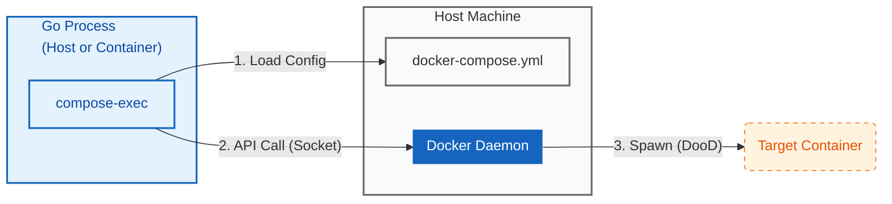

# compose-exec

[](https://pkg.go.dev/github.com/hnw/compose-exec)
[Japanese README (日本語ドキュメント)](./README_ja.md)

**Run Docker Compose services like `os/exec`. No Docker CLI required.**

`compose-exec` is a Go library that manages the lifecycle of containers directly via the Docker Engine API, using your `docker-compose.yml` as the definition.
It eliminates the need for the `docker` binary and shell scripts, providing a safer, programmable alternative for container automation.



## 📖 Usage (Integration Testing)

Example of using an existing `docker-compose.yml` to start a database and wait for it to be healthy before running tests.

```go
package main

import (
	"context"
	"fmt"
	"os"
	"github.com/hnw/compose-exec/compose"
)

func main() {
	// Context to manage container lifecycle
	ctx, cancel := context.WithCancel(context.Background())
	defer cancel()

	// 1. Load "db" service config from docker-compose.yml
	svc := compose.From("db")

	// 2. Define command (Empty args = use image default command)
	cmd := svc.Command()
	cmd.Stdout = os.Stdout
	cmd.Stderr = os.Stderr

	// 3. Start the container asynchronously
	if err := cmd.Start(ctx); err != nil {
		panic(err)
	}

	// Ensure container is removed when function exits
	defer cmd.Wait(ctx)

	// 4. ✨ Wait for Healthcheck
	// Uses the healthcheck defined in your YAML. No more arbitrary "sleep 10".
	fmt.Println("Waiting for DB to be healthy...")
	if err := cmd.WaitUntilHealthy(ctx); err != nil {
		panic(err)
	}

	// 5. Run your tests or logic
	fmt.Println("DB is ready! Running tests...")
	// runTests()
}

```

## 🏃 Try it now (Sibling Container Demo)

This repository itself serves as a functional demo.
Run the following to see the "Controller" container dynamically spawn and control a "Sibling" container. No Go installation required.

```bash
# Clone and run
git clone https://github.com/hnw/compose-exec.git
cd compose-exec
docker compose run controller

```

Execution Output

```text
[Controller] Launching 'Slow-Start' Target Container...
[Controller] 1. Attempting IMMEDIATE connection (Expect FAILURE)...
   -> As expected, connection failed: dial tcp: lookup target: no such host
[Controller] 2. Waiting for Target (Port 8080) to be Ready...
   -> Target is HEALTHY! Waited: 3.2s
[Controller] 3. Connecting to target:8080 ... SUCCESS!

```

This demonstrates the **DooD (Docker outside of Docker)** pattern, often used in CI environments.

## ✨ Why compose-exec?

* **No Docker Binary Required:**
Runs without the `docker` CLI installation. Compatible with `distroless` or `scratch` images.
* **Robust Lifecycle Management:**
Strictly ties container lifecycle to your Go `Context`. If your program panics or times out, containers are cleaned up ensuring no zombie processes.
* **Secure & Injection-Proof:**
Avoids shell execution entirely. By using the API directly, it structurally eliminates OS command injection risks.
Ideal for building secure **ChatOps bots** or **AI Agent sandboxes**.

## 🛠 Use Cases

1. **Self-Contained Integration Testing:**
Spin up infrastructure (DBs, MQs), run tests, and teardown everything within a single `go test` command. No Makefiles required.
2. **AI Agents / ChatOps:**
Build secure tools where AI agents can execute tasks in isolated containers. Since there is no `docker` binary inside the agent container, privilege escalation risks are minimized.

## ⚙️ Configuration (DooD Setup)

When running this library inside a container (Docker-outside-of-Docker), you must configure the volume mounts correctly.

**Mirror Mounting** is essential. You must map the host's current directory to the exact same path inside the container so that the Docker Daemon (running on the host) can resolve relative paths and bind mounts defined in your Compose file.

**docker-compose.yml (Controller Example):**

```yaml
services:
  controller:
    image: golang:1.24
    volumes:
      # 1. Access Docker API (Required)
      - /var/run/docker.sock:/var/run/docker.sock

      # 2. Mirror Mount (Required)
      # Map the host working dir (${PWD}) to the same path inside the container.
      - .:${PWD}

    # 3. Match Working Directory
    working_dir: ${PWD}

```

## Installation

```bash
go get github.com/hnw/compose-exec

```

## Requirements

* **Go:** 1.24+
* **Docker Engine:** API v1.40+
* **OS:** Linux, macOS, Windows (WSL2 recommended)

## License

MIT
