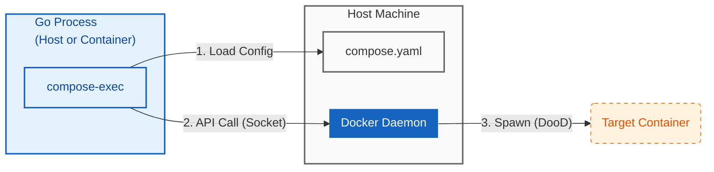

# compose-exec

[](https://pkg.go.dev/github.com/hnw/compose-exec)
[Japanese README (日本語ドキュメント)](./README_ja.md)

**Run Docker Compose services like `os/exec`. No Docker CLI required.**

`compose-exec` is a Go library that manages the lifecycle of containers directly via the Docker Engine API, using your `compose.yaml` as the definition.
It eliminates the need for the `docker` binary and shell scripts, providing a safer, programmable alternative for container automation.

## 🎯 Primary Use Case: ChatOps / AI Agents

You have a Go-based bot or agent running in a container, and it needs to execute many tools.
Bundling binaries for every tool grows the image and complicates updates; shelling out to `docker compose` adds surface area and operational complexity.

With `compose-exec`, each tool is a Compose service (a sibling container), and you call it with the same `os/exec`-style interface.

* Keep one small controller binary; add tools by editing `compose.yaml`.
* Run tools in isolated containers instead of embedding binaries.
* Tie container lifecycle to `context.Context` and avoid orphaned containers.

## 🧭 How it works


```mermaid
graph LR
    classDef host fill:#fafafa,stroke:#666,stroke-width:2px,color:#333;
    classDef container fill:#e3f2fd,stroke:#1565c0,stroke-width:2px,color:#0d47a1;
    classDef daemon fill:#1565c0,stroke:#fff,stroke-width:0px,color:#fff;
    classDef target fill:#fff3e0,stroke:#ef6c00,stroke-dasharray: 5 5,color:#e65100;

    subgraph Host ["Host Machine"]
        File["compose.yaml"]:::host
        Daemon[["Docker Daemon"]]:::daemon
    end

    subgraph Controller ["Go Process<br>(Host or Container)"]
        Lib["compose-exec"]:::container
    end

    Target("Target Container"):::target

    Lib -- "1. Load Config" --> File
    Lib -- "2. API Call (Socket)" --> Daemon
    Daemon -- "3. Spawn (DooD)" --> Target

    class Host host;
    class Controller container;

```

## 📖 Usage (Integration Testing)

Example of using an existing `compose.yaml` to start a database and wait for it to be healthy before running tests.
The same pattern applies to ChatOps: treat each service as a command target and call it via `Command()`.

```go
package main

import (
	"context"
	"fmt"
	"os"
	"github.com/hnw/compose-exec/compose"
)

func main() {
	// Context to manage container lifecycle
	ctx, cancel := context.WithCancel(context.Background())
	defer cancel()

	// 1. Define command bound to the "db" service (Empty args = use image default command)
	// Bind lifecycle to context
	cmd := compose.CommandContext(ctx, "db")
	cmd.Stdout = os.Stdout
	cmd.Stderr = os.Stderr

	// 2. Start the container asynchronously
	if err := cmd.Start(); err != nil {
		panic(err)
	}

	// Ensure container is removed when function exits
	defer cmd.Wait()

	// 3. ✨ Wait for Healthcheck
	// Uses the healthcheck defined in your YAML. No more arbitrary "sleep 10".
	fmt.Println("Waiting for DB to be healthy...")
	if err := cmd.WaitUntilHealthy(); err != nil {
		panic(err)
	}

	// 4. Run your tests or logic
	fmt.Println("DB is ready! Running tests...")
	// runTests()
}

```

## 🏃 Try it now (Running Pandoc as a Compose Service)

This repository itself serves as a functional demo: a Go "controller" converts `example/input.md` to HTML by calling **Pandoc** — which is not included in the controller image — as a sibling `pandoc` Compose service, just like an external `os/exec`-style interface. The HTML conversion result flows straight to the controller's stdout. No Go or Pandoc installation required.

```bash
# Clone and run
git clone https://github.com/hnw/compose-exec.git
cd compose-exec
docker compose run --rm controller
```

Execution Output

```text
[Controller] Converting Markdown to HTML...
[Controller] Running Pandoc via the "pandoc" Compose service.

Input: example/input.md

<h1 id="hello-pandoc">Hello, Pandoc</h1>
<p>This Markdown file is converted to HTML by the
<strong>pandoc</strong> Compose service.</p>
...

[Controller] Done. Pandoc ran in a separate container,
[Controller] so it is not installed in the controller image.
```

The controller image does not need to include Pandoc or its dependencies; Pandoc comes upstream as-is (`pandoc/core` with the version fully pinned). Upgrading Pandoc is a one-line change to the image tag in `compose.yaml`. The same pattern scales to any number of containerized tools — just add services and call them via `Command()`.

## ✨ Why compose-exec?

* **No Docker Binary Required:**
Runs without the `docker` CLI installation. Compatible with `distroless` or `scratch` images.
* **Robust Lifecycle Management:**
Strictly ties container lifecycle to your Go `Context`. If your program panics or times out, containers are cleaned up ensuring no zombie processes.
* **Secure & Injection-Proof:**
Avoids shell execution entirely. By using the API directly, it structurally eliminates OS command injection risks.
Ideal for building secure **ChatOps bots** or **AI Agent sandboxes**.
* **Compose as a Tool Registry:**
Add, upgrade, or swap tools by editing services in `compose.yaml` instead of shipping new binaries.

## ⚠️ Limitations / Compatibility

* `build` is not supported. `service.image` is required.
* Supported volume types are `bind` and `volume` only.
* This is not a full Docker Compose implementation. Only a subset of fields are applied
  (image, platform, command, entrypoint, working_dir, environment, env_file, ports, volumes, tmpfs, read_only, networks, network_mode, healthcheck, stop_signal, stop_grace_period, user, init, privileged, cap_add/cap_drop, security_opt, shm_size, extra_hosts, devices, mem_limit, mem_reservation, memswap_limit, cpus, cpu_shares, cpuset, ulimits, labels)
* TTY is not supported.

## ⚙️ Configuration (DooD Setup)

When running this library inside a container (Docker-outside-of-Docker), you must configure the volume mounts correctly.

**Mirror Mounting** is essential. You must map the host's current directory to the exact same path inside the container so that the Docker Daemon (running on the host) can resolve relative paths and bind mounts defined in your Compose file.

**compose.yaml (Configuration Example):**

```yaml
services:
  controller:
    image: golang:1.25
    volumes:
      # 1. Access Docker API (Required)
      - /var/run/docker.sock:/var/run/docker.sock

      # 2. Mirror Mount (Required)
      # Map the host current directory (${PWD}) to the same path inside the container.
      - .:${PWD}

    # 3. Match Working Directory
    working_dir: ${PWD}

```

## Installation

```bash
go get github.com/hnw/compose-exec

```

## Requirements

* **Go:** 1.24+
* **Docker Engine:** API v1.40+
* **OS:** Linux, macOS, Windows (WSL2 recommended)

## License

MIT
