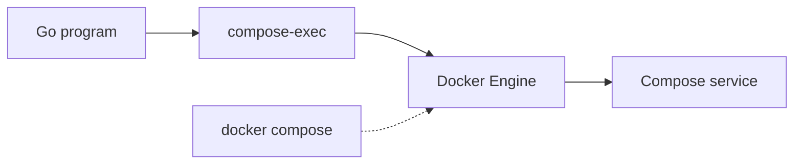

# compose-exec

[](https://pkg.go.dev/github.com/hnw/compose-exec)
[Japanese README](./README_ja.md)

`compose-exec` lets Go programs run containerized tools like external commands.

Keep each tool in its own Compose service instead of bundling it into the application image, and invoke it through an `os/exec`-like API.

```go
cmd := compose.CommandContext(ctx, "pandoc", "input.md", "-t", "html")
cmd.Stdout = os.Stdout
cmd.Stderr = os.Stderr

if err := cmd.Run(); err != nil {
	log.Fatal(err)
}
```

Tool-specific settings such as the image, volumes, environment variables, and networks stay in `compose.yaml`.

`compose-exec` talks to the Docker Engine directly instead of invoking `docker compose`.


```mermaid
flowchart LR
    Go["Go program"]
    CE["compose-exec"]
    CLI["docker compose"]
    Docker["Docker Engine"]
    Service["Compose service"]

    Go --> CE --> Docker --> Service
    CLI -.-> Docker
```

## Example

This repository includes a runnable Pandoc example with two services:

* `controller` runs the Go program using `compose-exec`
* `pandoc` provides Pandoc in a separate container

Compose services do not have to be long-running processes started with `docker compose up`. They can also be used as definitions for short-lived containers, as with `docker compose run`.

`compose-exec` uses the same idea: when the Go program invokes `pandoc`, it creates a container from the `pandoc` service definition and runs the requested command.

Run the example with:

```bash
git clone https://github.com/hnw/compose-exec.git
cd compose-exec
docker compose run --rm controller
```

Example output:

```text
[Controller] Converting Markdown to HTML...
[Controller] Running Pandoc via the "pandoc" Compose service.

Input: example/input.md

<h1 id="hello-pandoc">Hello, Pandoc</h1>
<p>This Markdown file is converted to HTML by the
<strong>pandoc</strong> Compose service.</p>
...

[Controller] Done. Pandoc ran in a separate container,
[Controller] so it is not installed in the controller image.
```

The `pandoc` service is defined in `compose.yaml`:

```yaml
services:
  pandoc:
    image: pandoc/core:3.11.0.0
    volumes:
      - ./example:/data
    working_dir: /data
```

Pandoc and its dependencies stay out of the controller image, and its version can be changed independently by updating the image tag.

If Go is installed locally, the same example can also be run directly:

```bash
go run ./example
```

In that case, the Go program runs on the host and only Pandoc runs in a container.

## Why compose-exec?

`compose-exec` is useful when a Go program needs to run one or more tools in containers while keeping their runtime setup in Compose.

Typical use cases include:

* keeping tools and their dependencies in separate container images
* updating tool versions independently from the application
* using stdin, stdout, stderr, and `context.Context` through an `os/exec`-like API

This works especially well for bots, agents, CI helpers, and automation services that call several containerized tools.

## Usage

```go
package main

import (
	"context"
	"log"
	"os"

	"github.com/hnw/compose-exec/compose"
)

func main() {
	ctx := context.Background()

	cmd := compose.CommandContext(ctx, "pandoc", "input.md", "-t", "html")
	cmd.Stdout = os.Stdout
	cmd.Stderr = os.Stderr

	if err := cmd.Run(); err != nil {
		log.Fatal(err)
	}
}
```

`Command()` and `CommandContext()` load the Compose project from the current working directory.

For repeated commands, load the project once and reuse it:

```go
project, err := compose.LoadProject(ctx, ".")
if err != nil {
	log.Fatal(err)
}

cmd := project.CommandContext(ctx, "tool", "--version")
```

## Docker-outside-of-Docker

The Go program can itself run inside a container while using the host Docker daemon.

In this setup, the controller uses the mounted Docker socket to start sibling containers from the service definitions in `compose.yaml`.

Mount the Docker socket and keep the project at the same absolute path on the host and inside the controller:

```yaml
services:
  controller:
    image: golang:1.25
    volumes:
      - /var/run/docker.sock:/var/run/docker.sock
      - .:${PWD}
    working_dir: ${PWD}
    environment:
      - PWD=${PWD}
```

Using the same path allows bind mounts in `compose.yaml` to refer to the correct host paths.

## Compose support

`compose-exec` supports the Compose settings commonly needed to run containerized tools and supporting services.

Notable limitations:

* `build` is not supported; services must specify `image`
* `compose-exec` is not a full Docker Compose implementation

Supported service fields include:

* `image`, `platform`
* `command`, `entrypoint`, `working_dir`
* `environment`, `env_file`
* `volumes`, `tmpfs`, `read_only`
* `ports`
* `networks`, `network_mode`, `extra_hosts`
* `healthcheck`
* `user`, `init`
* `stop_signal`, `stop_grace_period`
* `privileged`, `cap_add`, `cap_drop`, `security_opt`
* `shm_size`, `devices`
* `mem_limit`, `mem_reservation`, `memswap_limit`
* `cpus`, `cpu_shares`, `cpuset`
* `ulimits`, `labels`

Other Compose fields are outside the supported scope.

## Installation

```bash
go get github.com/hnw/compose-exec
```

## Requirements

* Go 1.24 or later
* Docker Engine API v1.40 or later

## License

MIT
