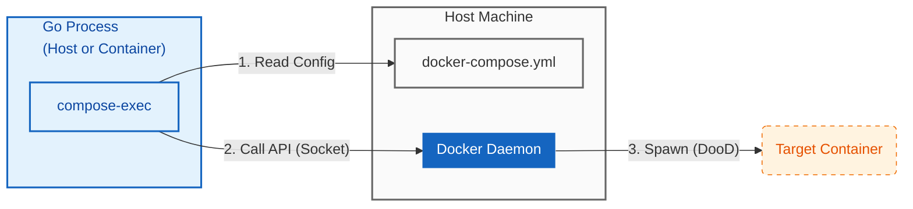

# compose-exec

[](https://pkg.go.dev/github.com/hnw/compose-exec)
[English README is here](./README.md)

**Goによる Docker Compose ネイティブ実行エンジン：依存関係ゼロの統合テスト & ミニマリストDooD**

`compose-exec` は、`docker-compose.yml` をそのまま活用し、Go言語からサービスのライフサイクルを直接制御するライブラリです。
`docker` コマンドやシェルスクリプトへの依存を排除し、「定義の二重管理がない統合テスト」や「セキュアで軽量なコンテナ操作エージェント」を実現します。



## 🏃 動作デモ (See it in action)

百聞は一見に如かず。このリポジトリ自体が、完全に機能するDooD環境のデモになっています。
以下のコマンドを実行すると、「親コンテナ(App)が、兄弟コンテナ(Sibling)を動的に起動・待機・制御する」様子を確認できます。

```bash
# 1. クローン
git clone https://github.com/hnw/compose-exec.git
cd compose-exec

# 2. デモ実行 (環境構築・テスト実行・後始末まで全自動)
docker compose run app

```

---

## ⚡ Why compose-exec?

既存のテストライブラリ（testcontainers-go等）やシェルスクリプトと比較した、3つの決定的なアドバンテージ：

### 1. 定義の二重管理を廃止 (Zero Configuration Drift)

本番用の `docker-compose.yml` があるのに、テストのためにGoの構造体でコンテナ定義を書き写す必要はありません。
`compose-exec` はYAMLを直接解釈するため、本番とテストの構成乖離（ドリフト）を根本から防ぎます。

### 2. 攻撃対象領域の最小化 (Minimalist DooD)

コンテナ内からDockerを操作するために、重厚な `docker` CLIバイナリやシェル環境をインストールする必要はありません。
DistrolessやScratchなどの極小イメージで動作するため、CIランナーやBotを数MBまで軽量化でき、結果としてセキュリティリスク（Attack Surface）を最小化できます。

### 3. Goネイティブなオーケストレーション

「DBのヘルスチェックが通るまで待機」「特定のログが出たら次へ」といった複雑なフローを、`WaitUntilHealthy` などのヘルパーを使って堅牢なGoコードとして記述できます。不安定な `sleep` や複雑なシェル芸は不要です。

---

## 🚀 クイックスタート

### インストール

```bash
go get github.com/hnw/compose-exec

```

### コード例：サービスの健全性を待機して実行

```go
package main

import (
	"context"
	"os"
	"github.com/hnw/compose-exec/compose"
)

func main() {
	ctx := context.Background()

	// 1. ターゲットとなるサービスを取得
	// docker-compose.yml の "sibling" サービス定義をロード
	// イメージのPullやネットワーク設定は自動処理されます
	svc := compose.From("sibling")

	// 2. コマンド定義
	cmd := svc.Command("echo", "Hello from container")
	cmd.Stdout = os.Stdout

	// 3. (Optional) ヘルスチェック待機
	// YAMLに healthcheck があれば、Readyになるまで自動待機します。
	// これにより「DBが立ち上がる前にテストが走って落ちる」問題を解決します。
	// if err := cmd.WaitUntilHealthy(ctx); err != nil {
	// 	panic(err)
	// }

	// 4. 実行と自動クリーンアップ
	if err := cmd.Run(ctx); err != nil {
		panic(err)
	}
}

```

---

## 🛠 具体的なユースケース

### A. 自己完結型の統合テスト

`go test` コマンド一つで、「インフラ構築 → テスト実行 → 破棄」の全工程が完了します。CIサービスごとの独自設定（Service Containers等）に依存せず、ローカルでもCIでも全く同じテストが動作します。

### B. 軽量な運用エージェント / ChatOps

Slack等の入力をトリガーにコンテナタスクを実行するBotに最適です。
CLIツールを持たないため、万が一Botが侵害されても、攻撃者が利用できるツールが存在せず（Living off the Land攻撃の防止）、被害を限定的に抑えられます。

---

## ⚙️ DooD 設定ガイド (CI / コンテナ内実行)

コンテナ内から `compose-exec` を使用する場合、ホスト側のファイルを正しく解決するためにミラーマウントが必要です。

```yaml
services:
  # 1. コントローラー (Goアプリ / CIランナー)
  controller:
    image: gcr.io/distroless/static-debian12:latest
    volumes:
      # 必須: Dockerソケット
      - /var/run/docker.sock:/var/run/docker.sock
      # 必須: ミラーマウント (ホストのカレントディレクトリを同じパスにマップ)
      - .:${PWD}
    working_dir: ${PWD}
    # 推奨: ホストファイルの権限問題を回避
    user: "${UID}:${GID}"

  # 2. ターゲット
  sibling:
    image: alpine:latest
    profiles:
      - manual # 自動起動防止

```

## トラブルシューティング

* **permission denied (docker.sock):**
Rootless Docker、Lima、Colima等を使用している場合、コンテナ内のユーザーがソケットへの書き込み権限を持っていない可能性があります。
* `docker-compose.yml` で `user: "${UID}:${GID}"` を指定する。
* または、ホスト側でソケットのパーミッションを確認してください。


* **file not found (mounts):**
DooD環境では、バインドマウントのパスは「ホスト側のパス」として解釈されます。コンテナ内のパスとホスト側のパスが一致していない場合、マウントに失敗します。上記の「ミラーマウント」設定を確認してください。

## 動作要件

* **Go:** 1.22以上
* **Docker Engine:** APIバージョン 1.40以上
* **OS:** Linux, macOS (Docker Desktop), Windows (WSL2推奨)

## ライセンス

MIT
