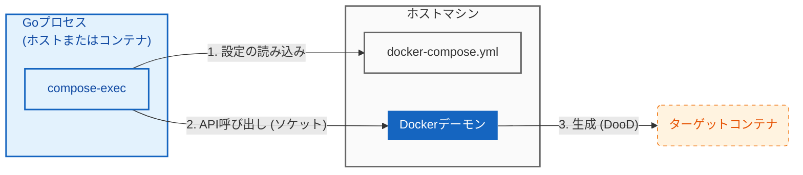

# compose-exec

[](https://pkg.go.dev/github.com/hnw/compose-exec)
[English README is here](./README.md)

**GoネイティブなDocker Compose自動化ライブラリ: CLI非依存・シェルスクリプト不要 **

`compose-exec` は、`docker-compose.yml` を定義として利用し、Docker Engine API を介して直接サービスを管理する Go ライブラリです。
`docker` コマンドや外部シェルスクリプトへの依存を排除し、`os/exec` を使用するよりも安全かつ堅牢なコンテナ管理を実現します。



## ⚡ Core Values

### 1. コンテナ管理の堅牢化 (Robust Container Lifecycle)
`exec.Command` で CLI を操作する場合、Go のコンテキストキャンセルとコンテナの停止を同期させるには複雑なシグナル処理が必要です。
本ライブラリは API を直接制御するため、Go プロセスの終了に合わせてコンテナを確実に停止・クリーンアップします。テスト中断時の**ゾンビコンテナ発生**を防ぎます。

### 2. バイナリ依存ゼロ (Zero Docker CLI Dependency)
実行環境に `docker` CLI をインストールする必要はありません。
これにより、CI 環境で `docker:dind` 等の重いイメージを使う必要がなくなり、`distroless` や `scratch` といった超軽量イメージ上でも動作します。Windows/Mac/Linux の環境差異（パスやシェル）にも悩みません。

### 3. OSコマンドインジェクション排除 (Injection-Proof Architecture)
ユーザー入力を引数としてシェルコマンドを組み立てる実装は、常にインジェクションのリスクを伴います。
本ライブラリはシェルを経由せず、ソケットを通じて API を直接叩くアーキテクチャを採用しています。構造的に **OS コマンドインジェクションが発生する余地を完全に排除** しており、ChatOps ボットや管理ツールを安全に開発できます。

## 🏃 動作デモ (See it in action)

百聞は一見に如かず。このリポジトリ自体が、完全に機能するDooD環境のデモになっています。
以下のコマンドを実行すると、「親コンテナ(controller)が、兄弟コンテナ(Sibling)を動的に起動・待機・制御する」様子を確認できます。

```bash
# 1. クローン
git clone https://github.com/hnw/compose-exec.git
cd compose-exec

# 2. デモ実行 (環境構築・テスト実行・後始末まで全自動)
docker compose run controller

```

---

## 🚀 クイックスタート

### インストール

```bash
go get github.com/hnw/compose-exec

```

> **注意:** このライブラリは、Composeファイルに基づいてイメージのプルとコンテナの作成を自動的に処理します。

### 例: ヘルスチェックの待機と実行

```go
package main

import (
	"context"
	"os"
	"github.com/hnw/compose-exec/compose"
)

func main() {
	ctx := context.Background()

	// 1. docker-compose.ymlで定義されたサービスをターゲットにする
	// "target" サービスの設定を読み込みます。
	svc := compose.From("target")

	// 2. コマンドを定義する
	cmd := svc.Command("echo", "Hello from container")
	cmd.Stdout = os.Stdout
	cmd.Stderr = os.Stderr

	// 3. (任意) ヘルスチェックを待機する
	// YAMLでヘルスチェックが定義されている場合、コンテナが正常になるまでブロックします。
	// データベースやAPIサービスの起動待機に最適です。
	// if err := cmd.WaitUntilHealthy(ctx); err != nil {
	// 	panic(err)
	// }

	// 4. 実行とクリーンアップ
	// ライフサイクル全体（開始 -> アタッチ -> 停止 -> 削除）を管理します。
	if err := cmd.Run(ctx); err != nil {
		panic(err)
	}
}

```

---

## 🛠 ユースケース

### A. 自己完結型の結合テスト

インフラの構築、実行、破棄までのテストスイート全体を、単一の`go test`コマンドで実行できます。`Makefile`や外部スクリプトは不要です。

### B. 軽量エージェント / ChatOps

特定のコンテナ化されたタスクを実行するボット（SlackやDiscordなど）の構築に理想的です。
コンテナ内に`docker`バイナリが存在しないため、万が一侵害された場合でも、攻撃者が標準ツールを利用して権限昇格を行うリスクを軽減できます。

---

## ⚙️ DooD設定 (CI / コンテナ)

コンテナ内で `compose-exec` を使用する場合、以下の点に注意してボリュームを設定してください。

1. **Dockerソケット**: Docker APIを操作するために必須です。
2. **プロジェクトディレクトリ**: `docker-compose.yml` を読み込むために必須です。
3. **ミラーマウント (強く推奨)**:
   ターゲットのサービスが**バインドマウント（ホストのファイルをマウント）を利用している場合**、ホスト側とコンテナ側のパスを完全に一致させる（ミラーマウントする）必要があります。
   パスが異なると、Dockerデーモンがホスト上の正しいファイルを見つけられなくなります。

```yaml
services:
  controller:
    image: golang:1.24
    volumes:
      # 1. Docker APIへのアクセス (必須)
      - /var/run/docker.sock:/var/run/docker.sock
      # 2 & 3. プロジェクトの読み込み + ミラーマウント
      # ホストのパス($PWD)を、コンテナ内の同じパス($PWD)にマウントする
      - .:${PWD}
    # コンテナ内の作業ディレクトリもホストと合わせる
    working_dir: ${PWD}

  # 2. ターゲットとなるシブリング (呼び出される側のサービス)
  target:
    image: alpine:latest
    profiles:
      - manual # 自動起動を防止
    volumes:
      - .:${PWD}
    working_dir: ${PWD}
```

## トラブルシューティング

* **permission denied (docker.sock):**
Rootless Docker、Lima、Colima等を使用している場合、コンテナ内のユーザーがソケットへの書き込み権限を持っていない可能性があります。
  * `docker-compose.yml` で `user: "${UID}:${GID}"` を指定する。
  * または、ホスト側でソケットのパーミッションを確認してください。

* **file not found (mounts):**
DooD環境では、バインドマウントのパスはホスト側のパスとして解釈されます。コンテナ内のパスとホスト側のパスが一致していない場合、マウントに失敗します。上記の「ミラーマウント」設定を確認してください。

## 要件

* **Go:** 1.24以上
* **Docker Engine:** APIバージョン 1.40以上
* **OS:** Linux, macOS (Docker Desktop), Windows (WSL2推奨)

## ライセンス

MIT
