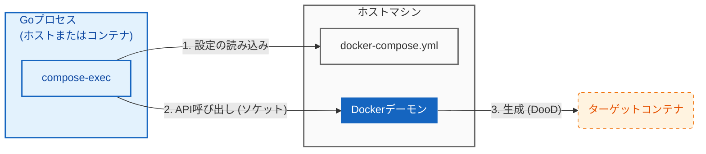

# compose-exec

[](https://pkg.go.dev/github.com/hnw/compose-exec)
[English README](./README.md)

**`os/exec` のように Compose サービスを扱う、Docker CLI 非依存の Go ライブラリ**

`compose-exec` は、`docker-compose.yml` を定義ファイルとして利用し、Go のコードから直接コンテナのライフサイクル（起動・実行・終了）を制御するライブラリです。
`docker` コマンドやシェルスクリプトを一切介さず、Docker Engine API を直接操作するため、安全かつ堅牢にコンテナを管理できます。

## 🎯 主用途: ChatOps / AI エージェント

Go 製のボットやエージェントがコンテナ内で多数のツールを実行する場合、必要なコマンドを全部同梱するとイメージが肥大化し、更新も煩雑になります。
一方で `docker compose` にシェルアウトすると、運用やセキュリティ面の複雑さが増えがちです。

`compose-exec` では、各ツールを Compose サービス（兄弟コンテナ）として定義し、`os/exec` 風のインターフェースで呼び出せます。

* 小さなコントローラーバイナリを保ったまま、ツールは `docker-compose.yml` の編集で追加・更新できます。
* バイナリ同梱ではなく、ツールを独立したコンテナとして隔離できます。
* `context.Context` と連動してコンテナを確実に終了でき、ゾンビ化を防げます。

## 🧭 仕組み



## 📖 Usage (Integration Testing)

既存の `docker-compose.yml` を利用して、DBの起動を待機してからテスト処理を実行する例です。
ChatOps でも同じパターンで、サービスをコマンドターゲットとして `Command()` から呼び出せます。

```go
package main

import (
	"context"
	"fmt"
	"os"
	"github.com/hnw/compose-exec/compose"
)

func main() {
	// 終了時にコンテナを停止させるためのコンテキスト
	ctx, cancel := context.WithCancel(context.Background())
	defer cancel()

	// 1. docker-compose.yml から "db" サービスの設定を読み込む
	svc := compose.From("db")

	// 2. コマンド定義（引数なし＝イメージのデフォルトコマンドを使用）
	cmd := svc.Command()
	cmd.Stdout = os.Stdout
	cmd.Stderr = os.Stderr

	// 3. コンテナを起動 (Start)
	if err := cmd.Start(ctx); err != nil {
		panic(err)
	}

	// 関数終了時に確実にコンテナを削除する
	defer cmd.Wait(ctx)

	// 4. ✨ ヘルスチェック通過を待機
	// docker-compose.yml の healthcheck 定義を使用します。
	// "sleep 10" のような不安定な待機処理は不要です。
	fmt.Println("Waiting for DB to be healthy...")
	if err := cmd.WaitUntilHealthy(ctx); err != nil {
		panic(err)
	}

	// 5. テストやバッチ処理の実行
	fmt.Println("DB is ready! Running tests...")
	// runTests()
}

```

## 🏃 Try it now (Sibling Container Demo)

このリポジトリ自体が動作デモになっています。
以下のコマンドを実行すると、「Go製のコントローラー（コンテナ）」が「兄弟コンテナ（Sibling）」を動的に起動・制御する様子を確認できます。Go のインストールも不要です。

```bash
# クローンして実行するだけ
git clone https://github.com/hnw/compose-exec.git
cd compose-exec
docker compose run controller

```

実行結果ログ (Output)

```text
[Controller] Launching 'Slow-Start' Target Container...
[Controller] 1. Attempting IMMEDIATE connection (Expect FAILURE)...
   -> As expected, connection failed: dial tcp: lookup target: no such host
[Controller] 2. Waiting for Target (Port 8080) to be Ready...
   -> Target is HEALTHY! Waited: 3.2s
[Controller] 3. Connecting to target:8080 ... SUCCESS!

```

このデモは、CI環境（GitHub Actionsなど）で Docker コンテナ内から他のコンテナを操作する DooD (Docker outside of Docker) パターンの実装例としても参照できます。

## ✨ Why compose-exec?

シェルスクリプトや `exec.Command("docker", ...)` と比較したメリット：

* **No Docker Binary Required:**
実行環境に `docker` CLI が不要です。`distroless` や `scratch` ベースの軽量コンテナ内でも動作します。
* **Robust Lifecycle Management:**
Go の `Context` と連動してコンテナを管理します。テストがタイムアウトしたりパニックした場合でも、コンテナは確実に停止・削除され、ゾンビプロセス化を防ぎます。
* **Secure & Injection-Proof:**
シェルを経由せず API を直接叩くため、OS コマンドインジェクションのリスクを構造的に排除しています。ChatOps ボットや、LLM (AI) がコードを実行するためのサンドボックス環境の実装に最適です。
* **Compose をツールレジストリ化:**
`docker-compose.yml` のサービス定義を変えるだけで、ツールの追加や更新ができます。

## ⚠️ Limitations / Compatibility

* `build` は未対応です。`service.image` が必須です。
* 対応するボリュームは `bind` と `volume` のみです。
* Docker Compose の全機能を実装するものではありません。適用されるのは一部のフィールドのみです
  (image, command, entrypoint, environment, ports, volumes, networks, healthcheck, user, init, privileged, cap_add/cap_drop)。
* TTY は未対応です。

## ⚙️ Configuration (DooD Setup)

コンテナ内（CI環境など）でこのライブラリを使用する場合、ホスト側の Docker デーモンを操作するための設定が必要です。

特に **「ミラーマウント（Mirror Mount）」** が重要です。コンテナ内のファイルパスとホスト側のファイルパスを一致させることで、Compose ファイルの相対パス解決やバインドマウントが正しく機能します。

**docker-compose.yml (Controller 側の設定例):**

```yaml
services:
  controller:
    image: golang:1.24
    volumes:
      # 1. Docker API ソケットの共有 (必須)
      - /var/run/docker.sock:/var/run/docker.sock

      # 2. ミラーマウント (必須)
      # ホストのカレントディレクトリ(${PWD})を、コンテナ内の同じパスにマウントする
      - .:${PWD}

    # 3. 作業ディレクトリの同期
    working_dir: ${PWD}

```

## Installation

```bash
go get github.com/hnw/compose-exec

```

## ❓ Troubleshooting

### "No such file or directory" or Connection Errors

Dockerソケットのマウントパスが間違っている可能性があります。
Linux の Rootless Docker や macOS の Lima, Colima, OrbStack 等を使用している場合、ホスト側のソケットパスは `/var/run/docker.sock` ではない場所に存在します。

**解決策:**
`docker-compose.yml` でホスト側のパスを変数として受け取れるように記述し、実行時に正しいパスを渡してください。

**docker-compose.yml:**

```yaml
services:
  controller:
    volumes:
      # 環境変数 DOCKER_SOCKET_PATH があれば使い、なければデフォルト値を使う
      # 注意: unix:// プレフィックスを含まない、絶対パスを指定してください
      - ${DOCKER_SOCKET_PATH:-/var/run/docker.sock}:/var/run/docker.sock

```

**実行時 (Lima/Colima/Rootless Dockerの例):**

```bash
# 例: DOCKER_HOSTから unix:// を除去する例
export DOCKER_SOCKET_PATH=${DOCKER_HOST#unix://}
docker compose run controller

```

## Requirements

* **Go:** 1.24以上
* **Docker Engine:** APIバージョン 1.40以上
* **OS:** Linux, macOS (Docker Desktop), Windows (WSL2推奨)

## License

MIT
