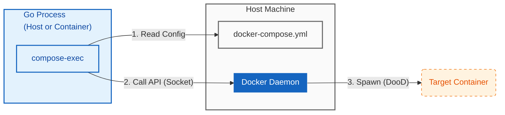

# compose-exec

[](https://pkg.go.dev/github.com/hnw/compose-exec)
[English README is here](./README.md)

**GoのためのプログラマブルなDocker Compose：自己完結型統合テストと軽量・セキュアなDooD**

`compose-exec` は、Docker Engine APIを介してDocker Composeサービスを直接管理するためのGoライブラリです。

既存の `docker-compose.yml` をそのまま活用し、使い慣れた `os/exec` インターフェースでコンテナのライフサイクルを制御します。外部のシェルスクリプトや `docker` バイナリへの依存を排除し、真にポータブルな「自己完結型」統合テストを実現します。



## ⚡ Core Value: なぜ compose-exec なのか？

### 1. 自己完結型の統合テスト

「シェルスクリプトの依存地獄」から解放されます。
外部ツール（Docker CLIやシェル）に依存せず、GoコードだけでDBやサーバーのライフサイクルを完全に制御できます。

* **Go Native Control:** エラーハンドリング、タイムアウト、シグナル処理といった複雑な制御を、壊れやすいシェルスクリプトではなく、堅牢なGoのロジックで記述できます。
* **Bring Your Own YAML:** テスト専用の定義を覚える必要はありません。プロダクションと同じ `docker-compose.yml` を再利用できます。

### 2. 超軽量・高効率

重厚な `docker` CLIバイナリやシェル環境をコンテナに含める必要はありません。
Docker Engine APIと直接通信するGoバイナリ単体で動作するため、CIランナーやエッジデバイスのリソースを圧迫せず、パイプラインの高速化に寄与します。

* **Minimal Footprint:** `Distroless` や `scratch` イメージで動作するため、イメージサイズを数MB単位まで極小化できます。リソースが制限されたIoT/エッジ環境のオーケストレーションにも最適です。
* **Secure by Design:** 結果としてコンテナ内からシェルや外部ツールが排除されるため、攻撃対象領域（アタックサーフェス）が最小化され、セキュアなDooD環境が実現します。

---

## 🏃 動作デモ

本リポジトリ自身が、機能するDooDのデモとなっています。
以下を実行することで、実際のCI環境を模した「兄弟コンテナパターン」の動作を確認できます。

```bash
# 1. クローン
git clone https://github.com/hnw/compose-exec.git
cd compose-exec

# 2. デモの実行
# "app" コンテナを起動し、そこから "sibling" コンテナを動的にオーケストレーションします。
docker compose run app

```

---

## 🚀 導入ガイド

### インストール

```bash
go get github.com/hnw/compose-exec

```

> **Note:** 本ライブラリは既存イメージの実行に特化しています。`docker compose build` は行いません（イメージがない場合は自動的にプルします）。ソースコード変更時は事前にビルドを行ってください。

### クイックスタート

```go
package main

import (
	"context"
	"os"
	"github.com/hnw/compose-exec/compose"
)

func main() {
	ctx := context.Background()

	// 1. docker-compose.yml で定義されたサービスを指定
	// ライブラリがイメージのプル、ネットワーク設定、クリーンアップを自動処理します。
	cmd := compose.From("sibling-target").Command("ls", "-la", "/app")

	// 2. パイプを接続
	cmd.Stdout = os.Stdout
	cmd.Stderr = os.Stderr

	// 3. 実行
	if err := cmd.Run(ctx); err != nil {
		// 終了コードは正しく伝播されます
		panic(err)
	}
}

```

---

## ⚙️ CI / コンテナ内での実行設定

コンテナ内から `compose-exec` を使用する場合（DooDパターン）、`docker-compose.yml` に以下の設定が必要です。

### 必須設定: ミラーマウント

`compose-exec` がホスト上の `docker-compose.yml` を正しく参照し、パスを解決するために、ホストの現在のディレクトリをコンテナ内の全く同じパスにマウントする（ミラーマウント） 必要があります。

```yaml
services:
  # 1. コントローラー (あなたのGoアプリ / CIランナー)
  controller:
    image: gcr.io/distroless/static-debian12:latest
    volumes:
      # 必須: Docker APIへのアクセス
      - /var/run/docker.sock:/var/run/docker.sock
      # 必須: ミラーマウント
      # ホストの現在のディレクトリをコンテナ内の同じ場所にマップする
      - .:${PWD}
    working_dir: ${PWD}
    # オプション: ホストファイルの権限問題を回避
    user: "${UID}:${GID}"

  # 2. ターゲットとなる兄弟コンテナ (呼び出されるサービス)
  sibling-target:
    image: alpine:latest
    profiles:
      - manual # 自動起動を防止

```

## トラブルシューティング

* **permission denied (docker.sock):**
Rootless Docker、Lima、または Colima を使用している場合、コンテナがソケットへの書き込み権限を持っていない可能性があります。`user: "${UID}:${GID}"` が設定されているか確認するか、ホスト側のソケット権限を確認してください。

## 動作要件

* **Go:** 1.22以上
* **Docker Engine:** APIバージョン 1.40以上
* **OS:** Linux, macOS (Docker Desktop), Windows (WSL2推奨)

## ライセンス

MIT
