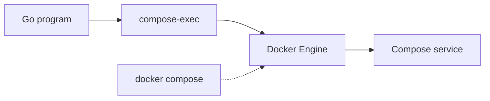

# compose-exec

[](https://pkg.go.dev/github.com/hnw/compose-exec)
[English README](./README.md)

`compose-exec` は、コンテナ化したツールを Go から外部コマンドのように実行するためのライブラリです。

ツールをアプリケーションイメージに組み込まず、それぞれを Compose サービスとして分離したまま、`os/exec` に近い API で呼び出せます。

```go
cmd := compose.CommandContext(ctx, "pandoc", "input.md", "-t", "html")
cmd.Stdout = os.Stdout
cmd.Stderr = os.Stderr

if err := cmd.Run(); err != nil {
	log.Fatal(err)
}
```

イメージ、volume、環境変数、network など、ツールの実行条件は `compose.yaml` にまとめて定義できます。

`compose-exec` は `docker compose` コマンドを起動せず、Docker Engine API を直接呼び出します。


```mermaid
flowchart LR
    Go["Go program"]
    CE["compose-exec"]
    CLI["docker compose"]
    Docker["Docker Engine"]
    Service["Compose service"]

    Go --> CE --> Docker --> Service
    CLI -.-> Docker
```

## Example

このリポジトリには、Pandoc をコンテナで実行する例があります。

デモは次の2つのサービスで構成されています。

* `controller`: `compose-exec` を使う Go プログラム
* `pandoc`: Pandoc を提供するコンテナ

Compose のサービス定義は、`docker compose up` で常駐コンテナを起動する用途だけでなく、`docker compose run` のように一時コンテナを起動する用途にも使えます。

`compose-exec` も同じ考え方で動作します。Go プログラムから `pandoc` を呼び出すと、`pandoc` サービスの定義を使って一時コンテナを作成し、その中で指定したコマンドを実行します。

次のコマンドでデモを実行できます。

```bash
git clone https://github.com/hnw/compose-exec.git
cd compose-exec
docker compose run --rm controller
```

実行例:

```text
[Controller] Converting Markdown to HTML...
[Controller] Running Pandoc via the "pandoc" Compose service.

Input: example/input.md

<h1 id="hello-pandoc">Hello, Pandoc</h1>
<p>This Markdown file is converted to HTML by the
<strong>pandoc</strong> Compose service.</p>
...

[Controller] Done. Pandoc ran in a separate container,
[Controller] so it is not installed in the controller image.
```

`pandoc` サービスは `compose.yaml` で次のように定義されています。

```yaml
services:
  pandoc:
    image: pandoc/core:3.11.0.0
    volumes:
      - ./example:/data
    working_dir: /data
```

Pandoc 本体やその依存関係を `controller` イメージに組み込む必要はありません。Pandoc のバージョンも、アプリケーションとは独立して image tag だけで変更できます。

ローカルに Go がインストールされていれば、同じプログラムをホストから直接実行できます。

```bash
go run ./example
```

この場合は Go プログラムだけがホスト上で動作し、Pandoc はコンテナ内で実行されます。

## Why compose-exec?

`compose-exec` は、Go プログラムからコンテナ化したツールを実行し、その実行環境を Compose で管理したい場合に向いています。

例えば、次のような用途があります。

* ツール本体と依存関係を、それぞれ独立したコンテナイメージに分離する
* ツールのバージョンをアプリケーションとは独立して更新する
* stdin、stdout、stderr、`context.Context` を `os/exec` に近い API で扱う

複数のコンテナ化されたツールを呼び出すボット、エージェント、CI ヘルパー、自動化サービスなどで利用できます。

## Usage

```go
package main

import (
	"context"
	"log"
	"os"

	"github.com/hnw/compose-exec/compose"
)

func main() {
	ctx := context.Background()

	cmd := compose.CommandContext(ctx, "pandoc", "input.md", "-t", "html")
	cmd.Stdout = os.Stdout
	cmd.Stderr = os.Stderr

	if err := cmd.Run(); err != nil {
		log.Fatal(err)
	}
}
```

`Command()` と `CommandContext()` は、カレントディレクトリから Compose project を読み込みます。

同じ project から複数のコマンドを実行する場合は、project を一度だけ読み込んで再利用できます。

```go
project, err := compose.LoadProject(ctx, ".")
if err != nil {
	log.Fatal(err)
}

cmd := project.CommandContext(ctx, "tool", "--version")
```

## Docker-outside-of-Docker

Go プログラム自体をコンテナ内で実行し、ホストの Docker daemon を利用する構成にも対応できます。

この構成では、`controller` からホストの Docker socket に接続し、`compose.yaml` のサービス定義を使って sibling container を起動します。

Docker socket に加えて project directory もマウントし、ホストと `controller` コンテナ内で同じ絶対パスになるようにします。

```yaml
services:
  controller:
    image: golang:1.26
    volumes:
      - /var/run/docker.sock:/var/run/docker.sock
      - .:${PWD}
    working_dir: ${PWD}
    environment:
      - PWD=${PWD}
```

同じ絶対パスに配置する必要があるのは、`compose.yaml` に書かれた bind mount のパスを Docker daemon がホスト側のパスとして解釈するためです。

## Compose support

`compose-exec` は、コンテナ化したツールとその関連サービスを実行するために必要な Compose 設定の一部に対応しています。

主な制限事項:

* `build` には対応していません。サービスには `image` の指定が必要です
* Docker Compose の完全な実装ではありません

対応しているサービス設定:

* `image`, `platform`
* `command`, `entrypoint`, `working_dir`
* `environment`, `env_file`
* `volumes`, `tmpfs`, `read_only`
* `ports`
* `networks`, `network_mode`, `extra_hosts`
* `healthcheck`
* `user`, `init`
* `stop_signal`, `stop_grace_period`
* `privileged`, `cap_add`, `cap_drop`, `security_opt`
* `shm_size`, `devices`
* `mem_limit`, `mem_reservation`, `memswap_limit`
* `cpus`, `cpu_shares`, `cpuset`
* `ulimits`, `labels`

上記以外の Compose 設定はサポート対象外です。

## Installation

```bash
go get github.com/hnw/compose-exec
```

## Requirements

* Go 1.26 以降
* Docker Engine 28 以降

## License

MIT
